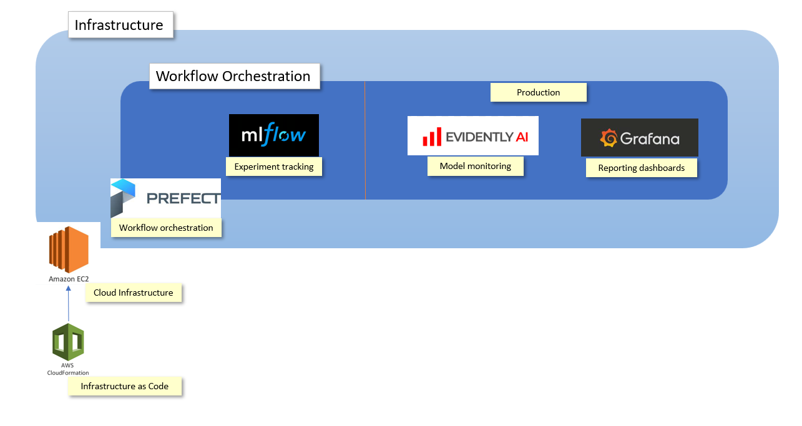

# Project-XGBoost-MLOps

Capstone project for MLOps Zoomcamp course.

# Problem Description

Losing customers is costly for any business. Therefore, identifying unhappy customers early on enables a company to offer them incentives to stay. Machine learning (ML) can be used for the automated identification of unhappy customers. This is also known as customer churn prediction. 

In this case, the company is a mobile phone operator and the data to be used is a relatively small dataset (< 5000 rows) and has 21 attributes:

- **State**: the US state in which the customer resides, indicated by a two-letter abbreviation; for example, OH or NJ
- **Account Length**: the number of days that this account has been active
- **Area Code**: the three-digit area code of the corresponding customer’s phone number
- **Phone**: the remaining seven-digit phone number
- **Int’l Plan**: whether the customer has an international calling plan: yes/no
- **VMail Plan**: whether the customer has a voice mail feature: yes/no
- **VMail Message**: the average number of voice mail messages per month
- **Day Mins**: the total number of calling minutes used during the day
- **Day Calls**: the total number of calls placed during the day
- **Day Charge**: the billed cost of daytime calls
- **Eve Mins**, **Eve Calls**, **Eve Charge**: the billed cost for calls placed during the evening
- **Night Mins**, **Night Calls**, **Night Charge**: the billed cost for calls placed during nighttime
- **Intl Mins**, **Intl Calls**, **Intl Charge**: the billed cost for international calls
- **CustServ Calls**: the number of calls placed to Customer Service
- **Churn?**: whether the customer left the service: true/false

The dataset we use is publicly available and was mentioned in the book [Discovering Knowledge in Data](https://www.amazon.com/dp/0470908742/) by Daniel T. Larose. It is attributed by the author to the University of California Irvine Repository of Machine Learning Datasets.  A copy of the dataset `churn.txt` can be found [here](https://github.com/BuzzKanga/Project-XGBoost-MLOps/tree/main/data).

I will re-use the data analysis performed by Denis V. Batalov, a Solutions Architect for AWS to determine which columns to drop, as the focus of this project is on the creation of the MLOps pipelineand not the data engineering required for a ML model. The analysis is decrived in this blog: [AWS Machine Learning Blog Post](https://aws.amazon.com/blogs/machine-learning/predicting-customer-churn-with-amazon-machine-learning/).

I will use the binary classification [XGBoost](https://xgboost.readthedocs.io/en/stable/index.html) algorithm to determine whether a customer is likely to churn.

## Architecture

## Project Deliverables

| Area                                   | Criteria                                                                                                                                                                                                                                        | Reference                                                                                                            |
| -------------------------------------- | ----------------------------------------------------------------------------------------------------------------------------------------------------------------------------------------------------------------------------------------------- | -------------------------------------------------------------------------------------------------------------------- |
| Problem Description                    | The problem is well described and it's clear what the problem the project solves                                                                                                                                                                | This document                                                                                                        |
| Cloud                                  | The project is developed on the cloud and IaC tools are used for provisioning the infrastructure                                                                                                                                                | [Cloud readme](https://github.com/BuzzKanga/Project-XGBoost-MLOps/blob/main/cloud%20readme.md)                       |
| Experiment tracking and model registry | Both experiment tracking and model registry are used                                                                                                                                                                                            | [MLFlow readme](https://github.com/BuzzKanga/Project-XGBoost-MLOps/blob/main/mlflow%20readme.md)                     |
| Workflow orchestration                 | Fully deployed workflow                                                                                                                                                                                                                         | [Prefect readme](https://github.com/BuzzKanga/Project-XGBoost-MLOps/blob/main/prefect%20readme.md)                   |
| Model deployment                       | The model deployment code is containerized and could be deployed to cloud or special tools for model deployment are used                                                                                                                        | [Model Deployment readme](https://github.com/BuzzKanga/Project-XGBoost-MLOps/blob/main/model%20deployment.md)        |
| Model monitoring                       | Comprehensive model monitoring that sends alerts or runs a conditional workflow (e.g. retraining, generating debugging dashboard, switching to a different model) if the defined metrics threshold is violated                                  | [Model Monitoring Readme](https://github.com/BuzzKanga/Project-XGBoost-MLOps/blob/main/monitoring%20readme.md)       |
| Reproducibility                        | Instructions are clear, it's easy to run the code, and it works. The versions for all the dependencies are specified.                                                                                                                           | [Reporoducibility readme](https://github.com/BuzzKanga/Project-XGBoost-MLOps/blob/main/reporoducibility%20readme.md) |
| Best practices                         | There are unit tests (1 point) There is an integration test (1 point) Linter and/or code formatter are used (1 point) There's a Makefile (1 point) There are pre-commit hooks (1 point) There's a CI/CD pipeline (2 points) | [Best Practices readme](https://github.com/BuzzKanga/Project-XGBoost-MLOps/blob/main/best%20practices%20readme.md)   |
