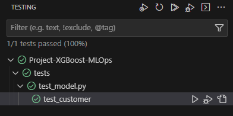

# Best Practices

## Unit tests

Unit tests are in this file: [test_model.py](tests/test_model.py) and have been run successfully:

## Makefile

Several makefiles used (depending on component to be set-up):

- [Setup makefile](setup/makefile)

- [Prefect makefile](prefect/makefile)

- [Deployment makefile](deployment/makefile)

- [Monitoring makefile](monitoring/makefile)

## Other Best Practices

Due to time constraints I did not have time to implement the followig:

- Integration test

- Linter and/or code formatter

- Pre-commit hooks

- A CI/CD pipeline
