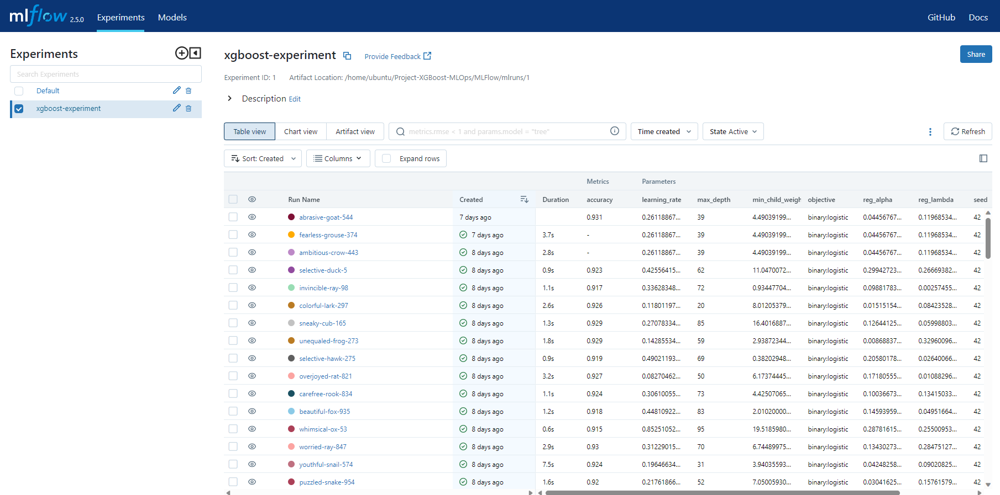
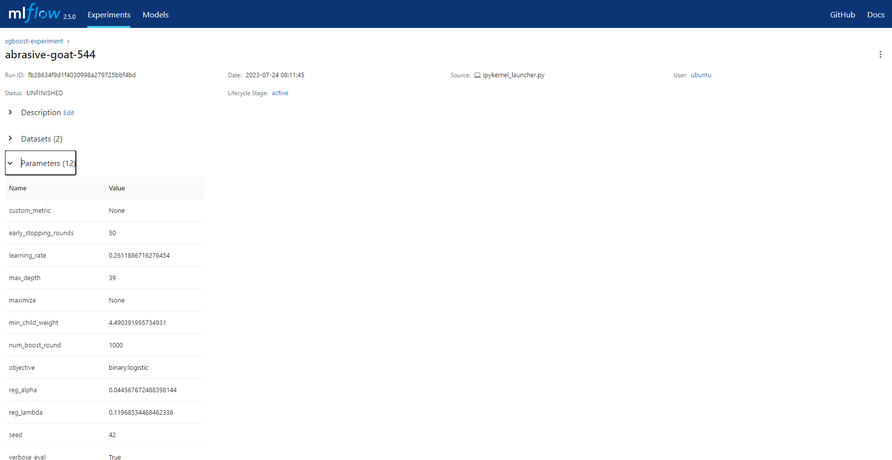
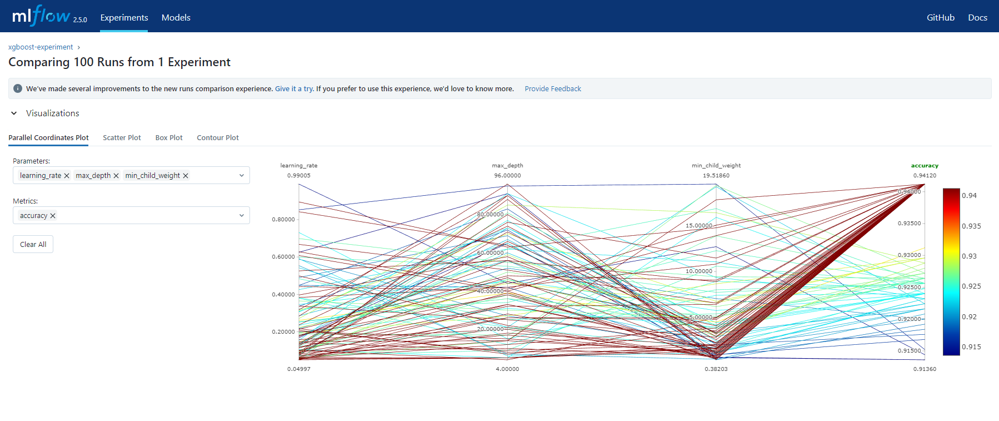
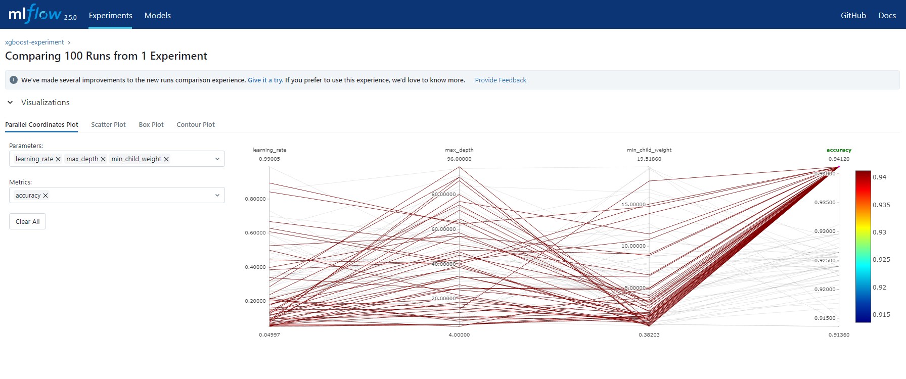
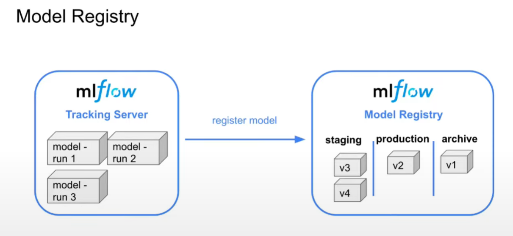

# MLFlow Setup

A Jupyter notebook [xgboost.ipynb](mlflow/xgboost.ipynb) was set up to train the XGBoost binary classifier using the [churn data](data/churn.txt). This model was then used to explote different parameters to find the optimal parametes for the model. Each set of parameters was saved as an experiment.

The notebook has mlfow commands to:

- create experiment

- log specific metrics

- perform auto-logging

It was based on a AWS Sagemaker sample notebook [xgboost_customer_churn.ipynb](mlflow/xgboost_customer_churn.ipynb), however, only the data analysis portion was used and AWS Sagemeker was not used for training the model.

The model was run with 100 different parameters which were then sorted on accuracy to find the model with the best performance:

The parameters for this model were recorded and used to create a predictor model. The parameters are shown here:

Anaylsis of the different parameter values is also possble to see which parameter values had the most impact on the model.

By highlighting only the raneg of values greater 93%, it is possible to see that low values of min_child_weight and the learning_rate usually produce better models.

The models can then be tagged as ready for production. MLFLow does not move the models, it merely creates tags that can be used by CICD pipeline for deployment to different environments.

