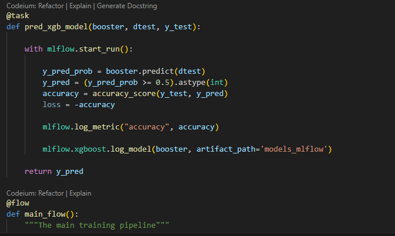
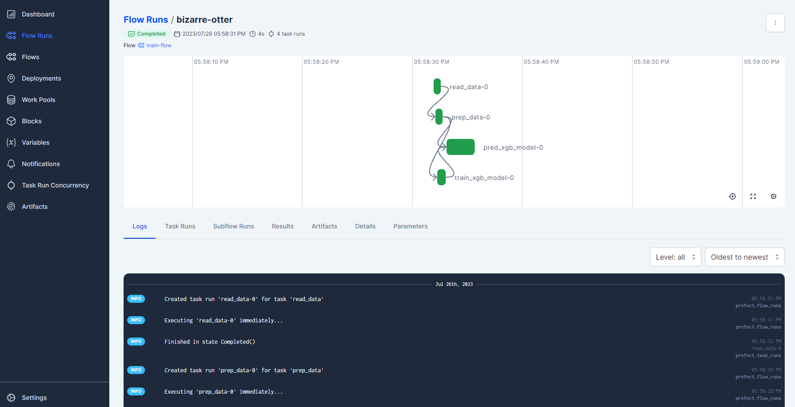

# Prefect

From the MLFlow set, we determined which were the best parameters to produce the bset model.

Prefect is used for workflow orchestration. The python code for for training the best model [prefect_xgboost.py](prefect/prefect_xgboost.py) is updated with @task and @flow decorators which Prefect uses to work out the workflow as the program runs.

Examples of the @task and @flow decorators

The workflow can be seen by running the prefect server command:
`prefect server start` which will then enable the workflow to be visualised as follows:

